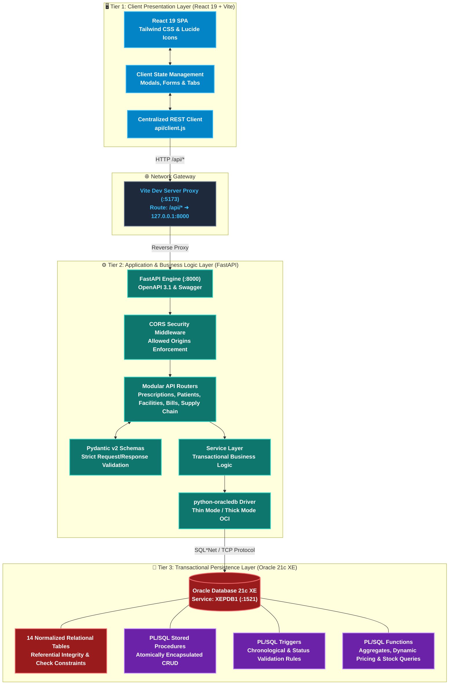
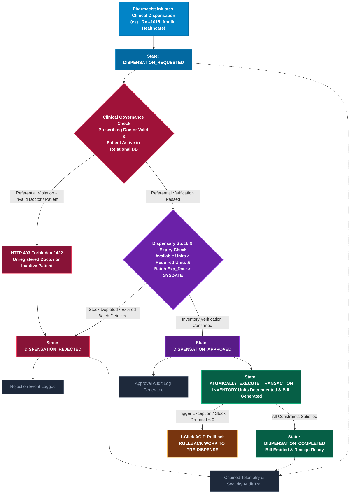
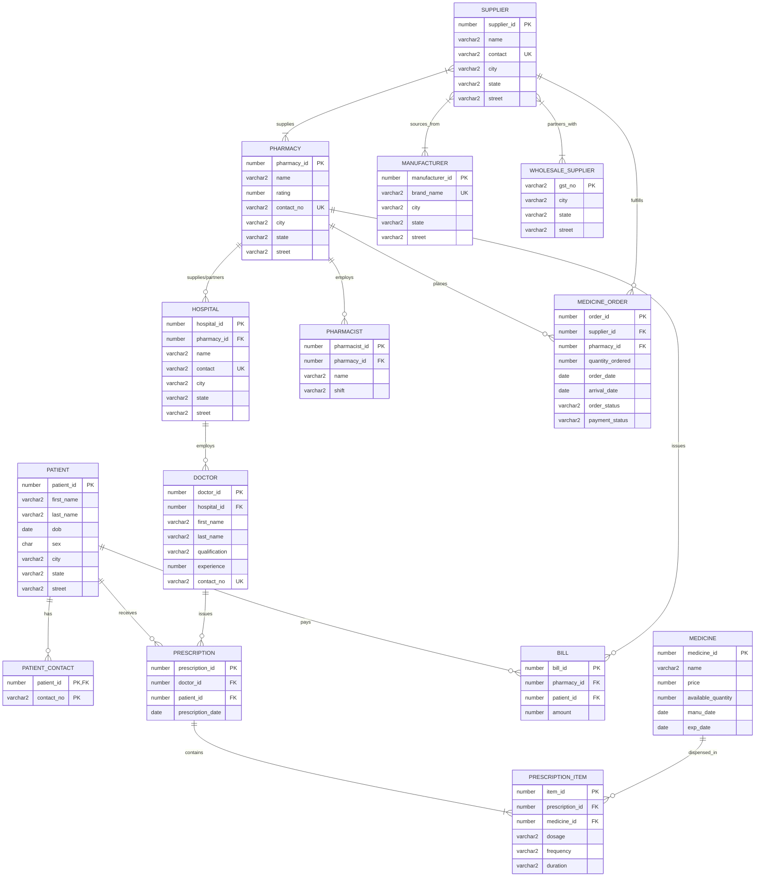
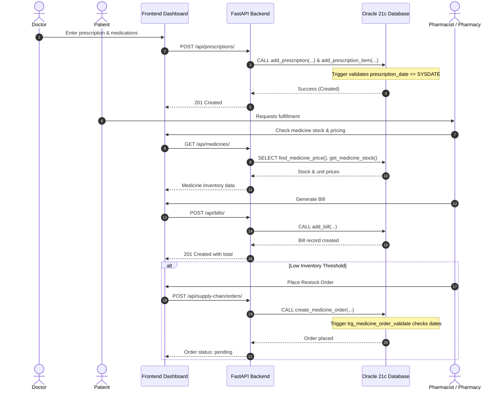

# 🩺 Prescription Tracking & Healthcare Management System (DBMS)

[](https://react.dev/)
[](https://vite.dev/)
[](https://tailwindcss.com/)
[](https://fastapi.tiangolo.com/)
[](https://www.python.org/)
[](https://www.oracle.com/database/)
[](#)

A comprehensive, full-stack **Database Management System (DBMS)** engineered to track medical prescriptions from clinical generation to pharmacy dispensing. The system bridges doctors, patients, pharmacies, hospitals, and pharmaceutical supply chains with strict relational constraints, automated PL/SQL business logic, and a responsive web dashboard.

---

## 📑 Table of Contents

1. [System Architecture](#1-system-architecture)
2. [Technology Stack](#2-technology-stack)
   - [Visual Technology Badge Wall](#visual-technology-badge-wall)
     - [Frontend & Presentation Architecture](#frontend--presentation-architecture)
     - [Backend Core & REST Runtime](#backend-core--rest-runtime)
     - [Enterprise Database & Storage Architecture](#enterprise-database--storage-architecture)
     - [Database Intelligence & PL/SQL Engine](#database-intelligence--plsql-engine)
     - [Infrastructure, Tooling & Verification](#infrastructure-tooling--verification)
3. [Database Design & Workflows](#3-database-design--workflows)
   - [Clinical Dispensation & Verification Flowchart](#clinical-dispensation--verification-flowchart)
   - [Entity-Relationship (ER) Diagram](#entity-relationship-er-diagram)
   - [Prescription & Order Lifecycle Sequence](#prescription--order-lifecycle-sequence)
4. [Key Features & Modules](#4-key-features--modules)
5. [Database Implementation (PL/SQL)](#5-database-implementation-plsql)
   - [Tables & Constraints](#tables--constraints)
   - [Stored Procedures](#stored-procedures)
   - [Database Triggers](#database-triggers)
   - [Stored Functions](#stored-functions)
6. [REST API Architecture](#6-rest-api-architecture)
7. [Getting Started & Installation](#7-getting-started--installation)
   - [Prerequisites](#prerequisites)
   - [1. Database Configuration](#1-database-configuration)
   - [2. Backend Setup](#2-backend-setup)
   - [3. Frontend Setup](#3-frontend-setup)
8. [Project Structure](#8-project-structure)
9. [Contributors](#9-contributors)

---

## 1. System Architecture

The project implements an enterprise-grade **3-Tier Architecture** separating presentation, business logic, and transactional persistence. The diagram below details the data flow between all subsystem tiers:



---

## 2. Technology Stack

### Visual Technology Badge Wall

#### Frontend & Presentation Architecture
[](https://react.dev/)
[](https://vite.dev/)
[](https://tailwindcss.com/)
[](https://developer.mozilla.org/en-US/docs/Web/JavaScript)
[](https://lucide.dev/)
[](https://oxc.rs/)
[](https://html.spec.whatwg.org/)
[](https://www.w3.org/Style/CSS/)

#### Backend Core & REST Runtime
[](https://www.python.org/)
[](https://fastapi.tiangolo.com/)
[](https://www.uvicorn.org/)
[](https://docs.pydantic.dev/)
[](https://oracle.github.io/python-oracledb/)
[](#)
[](https://pypi.org/project/python-dotenv/)
[](#)

#### Enterprise Database & Storage Architecture
[](https://www.oracle.com/database/technologies/xe-downloads.html)
[](#)
[](#)
[](#)
[](#)
[](#)

#### Database Intelligence & PL/SQL Engine
[](#)
[](#)
[](#)
[](#)
[](#)

#### Infrastructure, Tooling & Verification
[](https://git-scm.com/)
[](http://127.0.0.1:8000/docs)
[](#)
[](#)
[](#)

---

## 3. Database Design & Workflows

### Clinical Dispensation & Verification Flowchart

The state-driven decision flowchart below models the clinical and inventory integrity lifecycle when a pharmacist processes a prescription dispensation:



---

### Entity-Relationship (ER) Diagram

The relational schema establishes strict referential integrity across medical practitioners, patients, hospital affiliations, pharmaceutical stock, and B2B supply logistics:



---

### Prescription & Order Lifecycle Sequence



---

## 4. Key Features & Modules

- **📋 Prescription Administration**: Issue prescriptions linking verified doctors and patients, specify multi-drug dosages, intake frequency, and treatment duration.
- **🧑‍⚕️ Doctor & Hospital Directory**: Manage medical practitioners, qualifications, years of experience, and hospital department affiliations.
- **🏥 Patient Health Registry**: Track patient demographics, multi-contact directories, medical history, and cumulative prescription records.
- **💊 Medicine Inventory & Expiry Tracking**: Monitor unit prices, warehouse availability, manufactured dates, and automatically flag expired medicines (`exp_date > manu_date`).
- **🏪 Pharmacy Network & Staff Rotations**: Organize network pharmacies, customer ratings, locations, and assign pharmacist shifts (`morning`, `evening`, `night`).
- **💳 Automated Patient Billing**: Generate patient bills linked to pharmacies and calculate billing aggregates via PL/SQL routines.
- **🚚 End-to-End Supply Chain**: Manage pharmaceutical suppliers, wholesale partners (GST tracked), manufacturers, and medicine purchase orders with real-time status transitions (`pending` → `processing` → `shipped` → `delivered`).

---

## 5. Database Implementation (PL/SQL)

The database schema is organized under the `database/` directory and enforces relational integrity via PL/SQL scripts:

### Tables & Constraints (`01_tables.sql`)
- **Referential Integrity**: Cascading and foreign key constraints across 14 normalized relational tables.
- **Domain Constraints**:
  - `medicine`: Price must be strictly positive (`price > 0`), non-negative stock (`available_quantity >= 0`), and valid expiry (`exp_date > manu_date`).
  - `pharmacist`: Shifts restricted to `('morning', 'evening', 'night')`.
  - `medicine_order`: Status constrained to `('pending', 'processing', 'shipped', 'delivered', 'cancelled')`.

### Stored Procedures (`03_procedures.sql`)
Encapsulates transactional CRUD operations to avoid ad-hoc queries:
- `add_patient`, `update_patient`, `delete_patient`
- `add_doctor`, `update_doctor`, `delete_doctor`
- `add_pharmacy`, `update_pharmacy`, `delete_pharmacy`
- `add_prescription`, `add_prescription_item`
- `add_medicine`, `update_medicine_stock`
- `add_bill`, `create_medicine_order`, `update_order_status`

### Database Triggers (`04_triggers.sql`)
Enforces runtime business rules and chronological validity:
- `trg_patient_dob_validate`: Rejects patient birth dates set in the future (`:new.dob > SYSDATE`).
- `trg_prescription_date_validate`: Rejects prescription issue dates set in the future (`:new.prescription_date > SYSDATE`).
- `trg_medicine_order_validate`: Rejects orders where arrival precedes the order date (`:new.arrival_date < :new.order_date`).
- `trg_medicine_order_delivered`: Ensures an arrival date is explicitly recorded when an order status is marked as `delivered`.

### Stored Functions (`05_functions.sql`)
Reusable analytical functions:
- `find_medicine_price(p_medicine_id NUMBER) RETURN NUMBER`: Retrieves current unit price for a given drug.
- `get_medicine_stock(p_medicine_id NUMBER) RETURN NUMBER`: Returns on-hand inventory count.
- `get_doctor_experience(p_doctor_id NUMBER) RETURN NUMBER`: Returns doctor's years of practice.
- `get_patient_bill_total(p_patient_id NUMBER) RETURN NUMBER`: Uses `NVL(SUM(amount), 0)` to calculate total billing incurred by a patient across all pharmacies.

---

## 6. REST API Architecture

The FastAPI backend exposes modular, documented endpoints:

| Method | Endpoint | Description |
| :--- | :--- | :--- |
| `GET` | `/api/health` | System health check and Oracle DB connectivity state |
| `GET` / `POST` | `/api/prescriptions` | Query existing prescriptions or issue new ones with line items |
| `GET` / `POST` | `/api/patients` | Search patient records and register new profiles |
| `GET` / `POST` | `/api/medicines` | Query catalog, check stock, and register new drugs |
| `GET` / `POST` | `/api/facilities/pharmacies` | List pharmacies, ratings, and physical locations |
| `GET` / `POST` | `/api/facilities/doctors` | List doctors, hospital affiliations, and specialties |
| `GET` / `POST` | `/api/facilities/hospitals` | Hospital department directory and contacts |
| `GET` / `POST` | `/api/bills` | Generate patient invoices and query billing history |
| `GET` / `POST` | `/api/supply-chain/orders` | Issue pharmaceutical stock orders to suppliers |
| `GET` | `/docs` | Interactive OpenAPI / Swagger UI documentation |

---

## 7. Getting Started & Installation

### Prerequisites

Ensure you have the following installed on your machine:
- **Node.js**: `v20.18.0+` (or `v22.x+`) with `npm`
- **Python**: `3.10+` or `3.11+`
- **Oracle Database**: 21c XE (or Oracle Cloud Autonomous Database)
- **SQL Client**: SQL*Plus, Oracle SQL Developer, or DBeaver

---

### 1. Database Configuration

1. Launch your Oracle Database service (`XEPDB1` pluggable database).
2. Connect using `SQL*Plus` or `SQL Developer` as your administrative user:
   ```bash
   sqlplus PDBADMIN@//localhost:1521/XEPDB1
   ```
3. Execute the SQL scripts in numerical sequence:
   ```sql
   @database/01_tables.sql
   @database/02_data.sql
   @database/03_procedures.sql
   @database/04_triggers.sql
   @database/05_functions.sql
   ```
4. Verify table and procedure creation:
   ```sql
   SELECT table_name FROM user_tables;
   SELECT object_name, object_type FROM user_objects WHERE object_type IN ('PROCEDURE', 'TRIGGER', 'FUNCTION');
   ```

---

### 2. Backend Setup

1. Navigate to the backend directory:
   ```bash
   cd backend
   ```

2. Create and activate a Python virtual environment:
   ```bash
   # On macOS / Linux:
   python3 -m venv .venv
   source .venv/bin/activate

   # On Windows:
   python -m venv .venv
   .venv\Scripts\activate
   ```

3. Install required Python packages:
   ```bash
   pip install -r requirements.txt
   ```

4. Configure your environment variables:
   ```bash
   cp .env.example .env
   ```
   Edit `.env` to match your Oracle Database credentials:
   ```ini
   ORACLE_USER=PDBADMIN
   ORACLE_PASSWORD=your_secure_password
   ORACLE_HOST=localhost
   ORACLE_PORT=1521
   ORACLE_SERVICE=XEPDB1
   DEBUG=True
   ```

5. Launch the FastAPI server:
   ```bash
   uvicorn app.main:app --reload --host 127.0.0.1 --port 8000
   ```
   Access the interactive Swagger documentation at **`http://127.0.0.1:8000/docs`**.

---

### 3. Frontend Setup

1. Navigate to the `frontend/` directory:
   ```bash
   cd frontend
   ```

2. Install dependencies:
   ```bash
   npm install
   ```

3. Start the Vite development server:
   ```bash
   npm run dev
   ```

4. Open your browser and navigate to:
   ```
   http://localhost:5173
   ```
   *Note: Vite is pre-configured to proxy `/api/*` requests to the backend at `http://127.0.0.1:8000`.*

5. Build for production:
   ```bash
   npm run build
   ```

---

## 8. Project Structure

```
DBMS/
├── database/                    # Oracle 21c PL/SQL Database Layer
│   ├── 01_tables.sql            # Schema definitions, primary/foreign keys & constraints
│   ├── 02_data.sql              # Seed data for hospitals, doctors, patients, pharmacies
│   ├── 03_procedures.sql        # Transactional stored procedures (CRUD logic)
│   ├── 04_triggers.sql          # Integrity triggers (Date validation & delivery rules)
│   └── 05_functions.sql         # Query & calculation functions (Stock, pricing, billing)
│
├── frontend/                    # React 19 + Vite + Tailwind CSS Client
│   ├── public/                  # Favicon & static vector assets
│   │   ├── favicon.svg
│   │   └── icons.svg
│   ├── src/
│   │   ├── api/                 # Centralized HTTP client
│   │   │   └── client.js
│   │   ├── assets/              # Branding and vector artwork
│   │   │   └── hero.png
│   │   ├── components/          # Reusable UI widgets
│   │   │   ├── Dashboard.jsx
│   │   │   ├── Modal.jsx
│   │   │   ├── Navbar.jsx
│   │   │   └── StatsOverview.jsx
│   │   ├── pages/               # Application view modules
│   │   │   ├── BillingPage.jsx
│   │   │   ├── DoctorsPage.jsx
│   │   │   ├── HospitalsPage.jsx
│   │   │   ├── MedicinesPage.jsx
│   │   │   ├── PatientsPage.jsx
│   │   │   ├── PharmaciesPage.jsx
│   │   │   ├── PrescriptionsPage.jsx
│   │   │   └── SuppliersPage.jsx
│   │   ├── App.jsx              # Main routing & application layout
│   │   ├── main.jsx             # React DOM entry point
│   │   ├── index.css            # Tailwind CSS directives
│   │   └── App.css              # Custom styling
│   ├── index.html               # SPA HTML shell
│   ├── package.json             # Frontend dependency manifest
│   ├── vite.config.js           # Vite configuration & backend proxy
│   └── .oxlintrc.json           # Linter rules
│
├── .gitignore                   # Ignored files (node_modules, .venv, .env)
└── README.md                    # Comprehensive project documentation
```

---

## 9. Contributors

- **Sahana H** — [@sahanah621](https://github.com/sahanah621)
- **Harshit Sharma** — [@harshitsharma-6854](https://github.com/harshitsharma-6854)
- **Sreya** — [@sreyakj](https://github.com/sreyakj)

---

- **Repository**: [prescription-tracking-system](https://github.com/sahanah621/prescription-tracking-system)
- **Academic Context**: Database Management Systems (DBMS) Course Project.
